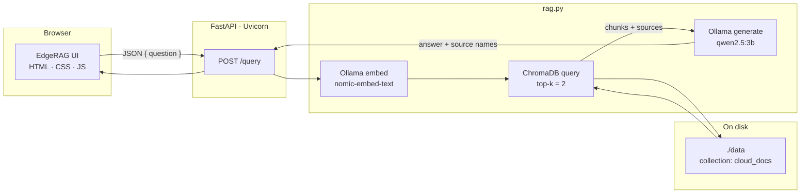
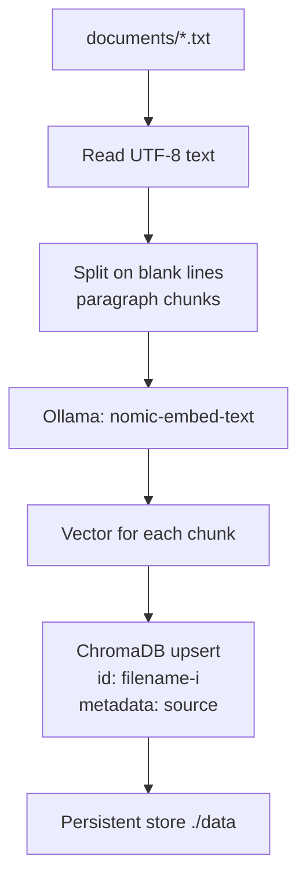
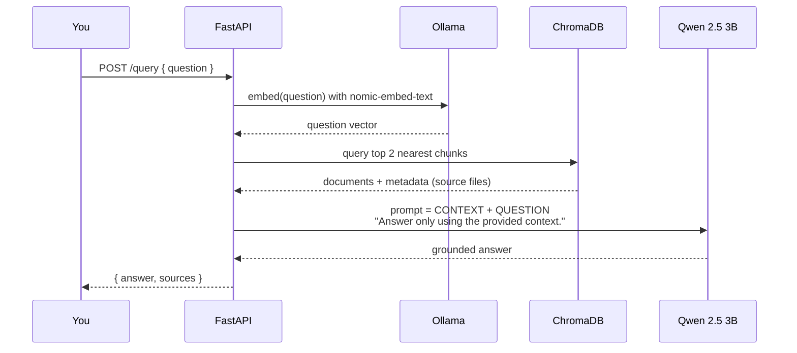

# EdgeRAG — Offline Edge RAG Chatbot

**EdgeRAG** is a fully local Retrieval-Augmented Generation (RAG) chatbot. You load your own documents, ask questions in a ChatGPT-style UI, and get answers grounded in that knowledge base — with **no cloud LLM APIs**. Queries, embeddings, and generation all run on-device through [Ollama](https://ollama.com/).

> EdgeRAG runs locally. Your data stays on-device.

<p align="center">
  
</p>

---

## Why this project

Typical RAG demos send your documents and prompts to a hosted API. EdgeRAG is built for **edge / air-gapped** use:

| Goal | How EdgeRAG does it |
| --- | --- |
| Privacy | Documents, embeddings, and chat never leave the machine |
| Offline inference | **Qwen 2.5 3B** and **nomic-embed-text** run via Ollama |
| Traceable answers | Retrieved files are shown under each reply (e.g. `cloud.txt`) |
| Grounded generation | The model is instructed to answer **only from retrieved context** |

If the knowledge base does not cover a topic, EdgeRAG says so instead of hallucinating from general training data:

<p align="center">
  
</p>

---

## Architecture



**Stack at a glance**

| Layer | Choice | Role |
| --- | --- | --- |
| LLM | **Qwen 2.5 (`qwen2.5:3b`)** | 3B-parameter instruct model — small enough for laptops / edge boxes, strong enough for grounded Q&A |
| Embeddings | **nomic-embed-text** | Converts document chunks and user questions into vectors via Ollama |
| Vector store | **ChromaDB** (`PersistentClient`) | Stores embeddings on disk under `./data` |
| Backend | **FastAPI** + **Uvicorn** | Serves the UI and `POST /query` |
| Runtime | **Ollama** | Local inference for both embedding and generation |
| Frontend | Vanilla HTML / CSS / JS | Dark chat UI, history in `localStorage` |

---

## How it works (step by step)

### 1. Ingest documents (offline indexing)

Drop `.txt` files into `documents/`, then run `python ingest.py`.



What `ingest.py` does:

1. Opens (or creates) the Chroma collection `cloud_docs`.
2. Reads every `.txt` file in `documents/` with UTF-8 encoding.
3. Splits each file on double newlines into paragraph-sized chunks.
4. Embeds each chunk with **nomic-embed-text**.
5. **Upserts** into Chroma so re-running ingest updates chunks instead of crashing on duplicate IDs.

Sample knowledge currently in the repo: `cloud.txt`, `docker.txt`, `kubernetes.txt`, `edge_computing.txt`.

### 2. Ask a question (retrieve + generate)

The UI posts the question to FastAPI. `rag.py` then:



Retrieval is **k = 2** nearest neighbors. Sources are de-duplicated so the UI can show tags like `cloud.txt`.

<p align="center">
  
</p>

### 3. Prompt contract

The LLM is not used as a general chatbot. The prompt is:

```text
Use the following context to answer the question.

CONTEXT:
<retrieved chunks>

QUESTION:
<user question>

Answer only using the provided context.
```

That is why in-scope questions (cloud, Docker, Kubernetes, edge computing) get cited answers, and out-of-scope questions return a refusal based on missing context.

---

## Models in more detail

### Qwen 2.5 3B (`qwen2.5:3b`)

- Instruct-tuned **3 billion parameter** model from the Qwen 2.5 family.
- Chosen as a **edge-friendly** generator: lower RAM/VRAM than 7B/14B class models, still capable of following the “answer only from context” instruction.
- Served locally by Ollama (`ollama generate`), not via Alibaba Cloud or any HTTP LLM API.

### nomic-embed-text

- Dedicated **text embedding** model pulled through Ollama.
- Used for **both** indexing (`ingest.py`) and query-time encoding (`rag.py`) so document and question vectors live in the same space.
- Typical embedding width for this model is **768 dimensions**.

### ChromaDB

- Embedded vector database — no separate server process.
- `chromadb.PersistentClient(path="./data")` writes collections to disk so the index survives restarts.
- Collection name: `cloud_docs`. Each chunk stores `metadata["source"]` (the original filename).

### FastAPI

- `main.py` is the production entrypoint:
  - `POST /query` — JSON body `{ "question": "..." }`, returns `{ "answer", "sources" }`.
  - Empty questions return **400**; RAG failures return **500**.
  - CORS is enabled for local development.
  - Static files from `frontend/` are mounted at `/` (HTML mode), so opening `http://127.0.0.1:8000` loads the chat UI.
- Uvicorn is the ASGI server (`python -m uvicorn main:app --host 127.0.0.1 --port 8000`).

`app.py` is an optional **CLI** client for the same RAG pipeline (no browser). `api.py` is an earlier API sketch; prefer `main.py`.

---

## Project structure

```text
.
├── main.py              # FastAPI app + static frontend
├── rag.py               # Embed → retrieve → Qwen generate
├── ingest.py            # Index documents into ChromaDB
├── app.py               # Terminal chatbot
├── api.py               # Alternate API (legacy)
├── frontend/            # Chat UI
│   ├── index.html
│   ├── style.css
│   └── app.js
├── documents/           # Source knowledge base (.txt)
├── docs/screenshots/    # README images
├── run.bat              # Windows: open browser + start Uvicorn
└── requirements.txt
```

---

## Quick start

### Prerequisites

1. **Python 3.10+**
2. **[Ollama](https://ollama.com/download)** installed and running
3. Pull the two local models:

```bash
ollama pull qwen2.5:3b
ollama pull nomic-embed-text
```

### Install and index

```bash
git clone https://github.com/mayursureshnair/Offline-Edge-RAG-AI.git
cd Offline-Edge-RAG-AI

python -m venv .venv
# Windows:
.venv\Scripts\activate
# macOS / Linux:
# source .venv/bin/activate

pip install -r requirements.txt
python ingest.py
```

### Run the web app

**Windows**

```bat
run.bat
```

**Any OS**

```bash
python -m uvicorn main:app --host 127.0.0.1 --port 8000
```

Open [http://127.0.0.1:8000](http://127.0.0.1:8000).

### CLI (optional)

```bash
python app.py
```

---

## Using your own documents

1. Add or replace `.txt` files in `documents/`.
2. Re-run `python ingest.py` (upserts by `filename-i`).
3. Ask questions in the UI. Source chips will show the filenames that were retrieved.

Keep chunks reasonably short: ingest splits on **blank lines**, so structure your files as paragraphs.

---

## API

`POST /query`

```json
{ "question": "What are the advantages of cloud computing?" }
```

Response:

```json
{
  "answer": "...",
  "sources": ["cloud.txt"]
}
```

---

## License

Use and modify freely for learning and local deployments. Add a formal license file if you need one for your organization.
