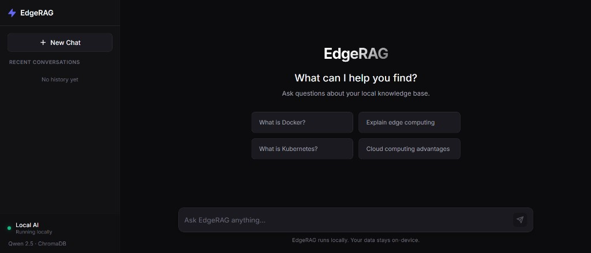
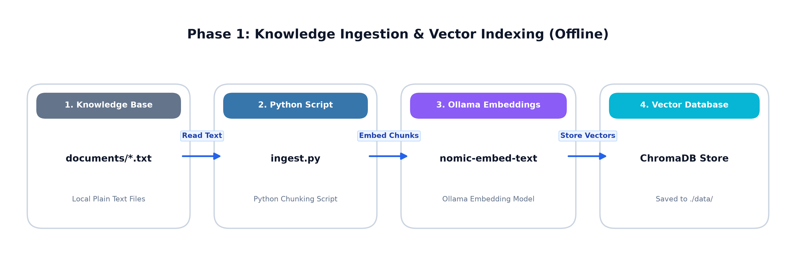
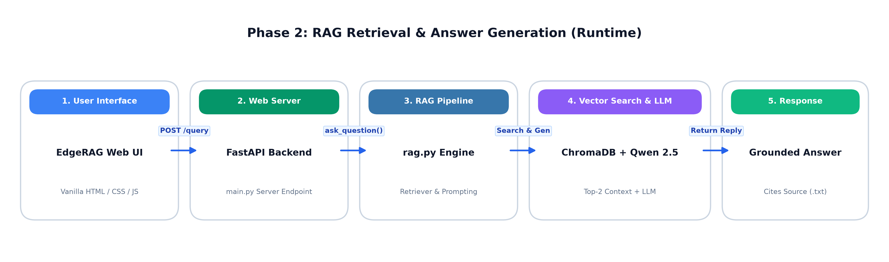
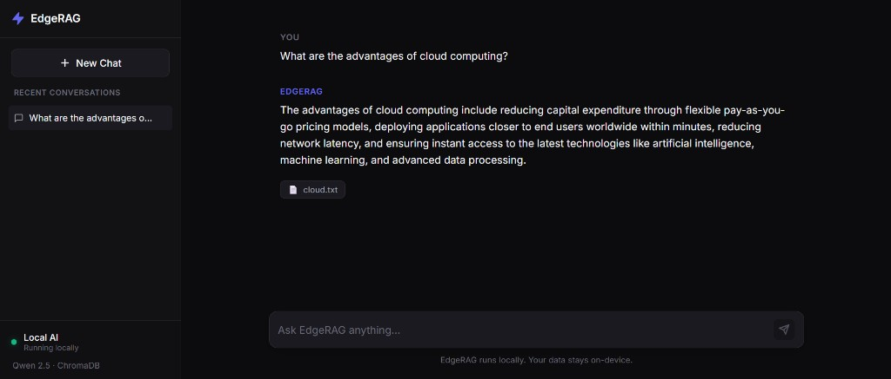
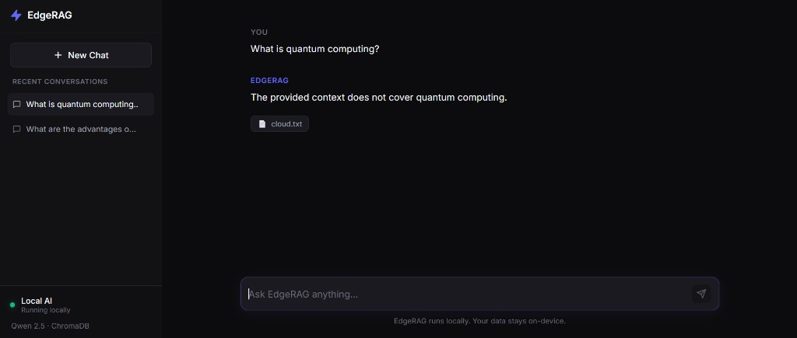

# EdgeRAG — Offline AI Knowledge Assistant

> A privacy-focused, local RAG AI assistant that uses a local language model and vector search to answer questions from a customizable knowledge base without relying on cloud AI APIs.

Repository: [https://github.com/mayursureshnair/Offline-Edge-RAG-AI.git](https://github.com/mayursureshnair/Offline-Edge-RAG-AI.git)

<p align="center">
  
</p>

---

## Overview

**EdgeRAG** is a clean, local Retrieval-Augmented Generation (RAG) system designed to run entirely on-device. Users provide local plain text (`.txt`) documents, which are vectorized and queried locally. When a user asks a question through the web interface or terminal CLI, EdgeRAG retrieves relevant document chunks and synthesizes precise, source-backed answers using a local Large Language Model.

---

## Why EdgeRAG?

* **Local Processing**: Operations run directly on your hardware via Ollama and ChromaDB.
* **No Cloud AI APIs**: No dependency on third-party SaaS APIs, API keys, or active subscriptions.
* **Data Stays On-Device**: Knowledge files and user queries never leave your local environment.
* **Fully Offline Operation**: After downloading initial models and dependencies, the system functions completely offline.
* **Customizable Knowledge Base**: Swap, edit, or append `.txt` documents without altering any Python codebase logic.

---

## Features

* **Offline / On-Device RAG Pipeline** powered by Ollama.
* **Qwen 2.5 3B (`qwen2.5:3b`)**: Lightweight, instruct-tuned LLM optimized for local edge execution.
* **Nomic Embeddings (`nomic-embed-text`)**: High-performance vector embeddings for semantic document search.
* **ChromaDB**: On-disk persistent vector store (`./data`) for document chunks.
* **FastAPI Backend**: Clean ASGI web server handling question retrieval and streaming response payloads.
* **Source-Aware Answers**: Every answer cites the exact filename source (e.g. `cloud.txt`) used to construct the response.
* **Dark-Themed Modern Frontend**: Responsive HTML/CSS/JS UI featuring chat session history in `localStorage`.
* **CLI Terminal Mode**: Optional terminal interface (`python app.py`) for quick command-line queries.

---

## Architecture

The core data pipeline flows through the following stages:

```text
Local .txt Documents
        ↓
   ingest.py
        ↓
Nomic Embeddings
        ↓
    ChromaDB
        ↓
Semantic Retrieval
        ↓
   Qwen 2.5 3B
        ↓
     FastAPI
        ↓
   EdgeRAG UI
```

### Flowchart Breakdown

#### Phase 1: Knowledge Ingestion & Vector Indexing (Offline)

<p align="center">
  
</p>

#### Phase 2: RAG Retrieval & Answer Generation (Runtime)

<p align="center">
  
</p>


### Detailed Workflow Step-by-Step

| Step | Layer | Action / Process | Output / Result |
| --- | --- | --- | --- |
| **1. Indexing** | Ingestion Script | `ingest.py` reads `.txt` files & splits on blank lines (`\n\n`) | Clean text paragraph chunks |
| **2. Embedding** | Ollama Engine | `nomic-embed-text` generates vector representations | 768-dimensional float vectors |
| **3. Storage** | ChromaDB | Upserts chunks with source metadata into `./data` | Persistent local vector store (`cloud_docs`) |
| **4. User Query** | Web Frontend | User sends question through dark-themed UI | `POST /query` to FastAPI |
| **5. Vector Search**| RAG Backend | `rag.py` embeds query & searches ChromaDB (`n_results=2`) | Top 2 matching document chunks |
| **6. Generation** | Qwen 2.5 3B | LLM generates grounded answer strictly using context | Context-bound response text |
| **7. Rendering** | Web Frontend | UI renders response markdown with source chips (e.g. `cloud.txt`) | Interactive, cited response |


### Technology Stack

| Component | Choice | Description |
| --- | --- | --- |
| **LLM** | Qwen 2.5 3B (`qwen2.5:3b`) | 3-Billion parameter instruct model running locally via Ollama |
| **Embedding Model** | Nomic Embed Text (`nomic-embed-text`) | 768-dimensional text embedding model |
| **Vector Database** | ChromaDB (`PersistentClient`) | Embedded vector store saving embeddings to `./data` |
| **Backend API** | FastAPI + Uvicorn | High-performance Python web framework |
| **Frontend UI** | Vanilla HTML5 / CSS3 / ES6 JS | Clean dark-mode UI with sidebar history |
| **Inference Engine** | Ollama | Local model runner and manager |

---

## Screenshots & Workflows

### Grounded Source Answers
When a user asks a question covered in the knowledge base, EdgeRAG retrieves relevant chunks and displays the source file tag.

<p align="center">
  
</p>

### Context Refusal (Out-of-Scope Protection)
If the knowledge base does not contain relevant context, EdgeRAG informs the user rather than hallucinating from general model weight pre-training.

<p align="center">
  
</p>

---

## Requirements

* **Python 3.10+**
* **Ollama** installed on host machine ([ollama.com](https://ollama.com))
* Required Ollama models:
  * `qwen2.5:3b`
  * `nomic-embed-text`
* Python dependencies (listed in `requirements.txt`):
  * `fastapi`
  * `uvicorn`
  * `pydantic`
  * `ollama`
  * `chromadb`

---

## Installation

1. **Clone the repository**:
   ```bash
   git clone https://github.com/mayursureshnair/Offline-Edge-RAG-AI.git
   cd Offline-Edge-RAG-AI
   ```

2. **Create and activate a virtual environment**:
   * Windows (PowerShell):
     ```powershell
     python -m venv .venv
     .venv\Scripts\Activate.ps1
     ```
   * macOS / Linux:
     ```bash
     python3 -m venv .venv
     source .venv/bin/activate
     ```

3. **Install Python dependencies**:
   ```bash
   pip install -r requirements.txt
   ```

4. **Pull Ollama models**:
   Make sure Ollama is running, then pull the LLM and embedding model:
   ```bash
   ollama pull qwen2.5:3b
   ollama pull nomic-embed-text
   ```

---

## Customize the Knowledge Base

The knowledge base is composed of plain text files located in the `documents/` directory:

```text
documents/
├── cloud.txt
├── docker.txt
├── edge_computing.txt
└── kubernetes.txt
```

You can customize your assistant's knowledge without touching any Python code:

### Workflow

1. **Add / Remove / Modify `.txt` files** inside the `documents/` directory.
2. **Re-index documents**:
   ```bash
   python ingest.py
   ```
3. **Start the FastAPI backend**:
   ```bash
   python -m uvicorn main:app --host 127.0.0.1 --port 8000
   ```
4. **Open the local EdgeRAG frontend** in your browser at `http://127.0.0.1:8000`.
5. **Ask questions** grounded in your updated knowledge base.

*Note: `ingest.py` splits text files on double newlines (`\n\n`) and uses upserts in ChromaDB, preventing duplicate ID conflicts when re-running ingestion.*

---

## Usage

### Web Interface (Recommended)

1. Ensure Ollama service is running locally.
2. Run ingestion if documents have changed:
   ```bash
   python ingest.py
   ```
3. Start the FastAPI server:
   * **Windows Quick-Start**:
     Double-click `run.bat` or run:
     ```cmd
     run.bat
     ```
   * **Cross-Platform Shell**:
     ```bash
     python -m uvicorn main:app --host 127.0.0.1 --port 8000
     ```
4. Navigate to `http://127.0.0.1:8000` in your web browser.

### Terminal CLI Mode

For headless environments or quick command-line testing:

```bash
python app.py
```

---

## Example Questions

Questions answered by default sample knowledge files (`cloud.txt`, `docker.txt`, `edge_computing.txt`, `kubernetes.txt`):

* **What is Docker?**
* **What is Edge AI?**
* **What is AWS EC2?**
* **How does Kubernetes work?**

---

## Project Structure

```text
Offline-Edge-RAG-AI/
├── .gitignore             # Git ignore configuration
├── README.md              # Project documentation
├── requirements.txt       # Python package dependencies
├── main.py                # Primary FastAPI app & static file server
├── rag.py                 # RAG pipeline logic (Embedding, ChromaDB query, LLM call)
├── ingest.py              # Document ingestion & vector store indexing script
├── app.py                 # CLI terminal interface
├── api.py                 # Alternate/legacy API endpoint sketch
├── test_embeddings.py     # Independent RAG verification script
├── run.bat                # Windows automated launcher script
├── documents/             # Knowledge base directory (.txt files)
│   ├── cloud.txt
│   ├── docker.txt
│   ├── edge_computing.txt
│   └── kubernetes.txt
├── docs/                  # Documentation assets & screenshots
│   └── screenshots/
│       ├── grounded-answer.png
│       ├── home.png
│       └── out-of-scope.png
└── frontend/              # Web user interface static files
    ├── app.js             # Client logic & state management
    ├── index.html         # Application layout
    └── style.css          # Dark design theme styles
```

---

## Limitations

* **Plain Text Only**: Current ingestion pipeline strictly processes `.txt` files split on double newline paragraphs.
* **Local Resource Dependent**: Speed depends on host machine hardware (GPU/CPU/RAM) running Ollama.
* **Retrieval Window**: Queries fetch the top-2 nearest chunks (`n_results=2`), optimized for concise Q&A.
* **Knowledge Bound**: Answers are strictly constrained by the uploaded context.

---

## Future Improvements

* PDF document ingestion support
* Multi-document folder upload via web interface
* Advanced text splitting strategies (semantic & token chunking)
* Document page and paragraph line number citations
* Multi-collection switching and knowledge base management
* Reranking with Cross-Encoder models
* Additional document format handlers (Markdown, DOCX, CSV)

---

## License

This project is open-source and free to modify for educational, personal, and edge deployment purposes.
